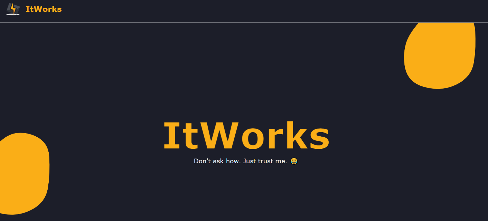

# 💻 Code Editor

A web-based code editor application built with a separate **Frontend** and **Backend**, allowing users to write and work with code through a simple browser-based interface.

## 🚀 Features

* 📝 Online code editor
* 💻 Clean and interactive coding interface
* ⚡ Separate frontend and backend architecture
* 🔌 Backend API integration
* 🌐 Runs locally in the browser
* 📂 Organized frontend and backend structure

## 🛠️ Technologies Used

### Frontend

* React.js
* JavaScript
* HTML
* CSS

### Backend

* Node.js
* Express.js

## 📁 Project Structure

```text
Code-Editor/
│
├── backend/
│   ├── package.json
│   ├── server.js
│   └── ...
│
├── frontend/
│   ├── package.json
│   ├── src/
│   └── ...
│
├── README.md
└── ...
```

## ▶️ How to Run

The project has two parts: **Backend** and **Frontend**.

Both need to be installed and started separately.

### 🔹 Backend

Open a terminal in the project directory and run the following commands:

#### 1. Navigate to Backend

```bash
cd ./backend
```

#### 2. Install Dependencies

```bash
npm install
```

#### 3. Start the Backend Server

```bash
npm start
```

Once the backend server starts successfully, keep this terminal running.

### 🔹 Frontend

Open a **new terminal** in the project directory and run:

#### 1. Navigate to Frontend

```bash
cd ./frontend
```

#### 2. Install Dependencies

```bash
npm install
```

#### 3. Start the Frontend

```bash
npm run dev
```

Vite will provide a local URL in the terminal.

Open that URL in your browser and you're good to go! 🚀

## 📸 Result

Here is how the Code Editor looks:




## 🔮 Future Improvements

Some features that can be added in the future:

* 🌐 Multi-language support
* ▶️ Run code directly inside the editor
* 💾 Save code/files
* 📁 File and folder management
* 👥 Real-time collaborative coding
* 🔐 User authentication
* 🎨 Multiple editor themes
* 📤 Export/download code

## 👨‍💻 Author

Developed as a **Web-Based Code Editor** project using React.js, Node.js and Express.js.
