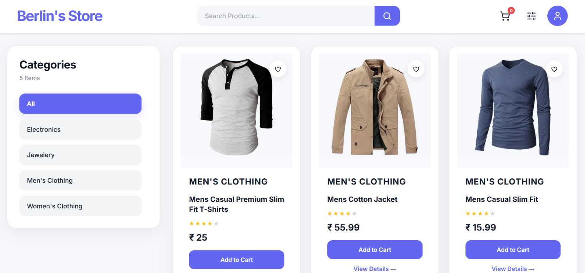

# 🛒 E-Commerce Web Application

A full-stack **E-Commerce Web Application** built using the **MERN stack**. The application provides a complete shopping experience with product browsing, authentication, cart management and other e-commerce functionalities.

## 🚀 Features

* 🛍️ Browse products
* 🔎 Search and filter products
* 📦 Product details
* 🛒 Add products to cart
* 🔐 User authentication
* 👤 User registration and login
* 🔑 JWT-based authentication
* 🗄️ MongoDB database integration
* ⚡ RESTful APIs
* 📱 Responsive user interface
* 👨‍💼 Admin/product management functionality

## 🛠️ Technologies Used

### Frontend

* React.js
* JavaScript
* HTML
* CSS
* Axios

### Backend

* Node.js
* Express.js
* MongoDB
* Mongoose
* JSON Web Token (JWT)

## 📁 Project Structure

```text
ECommerce/
│
├── backend/
│   ├── package.json
│   ├── .env
│   └── ...
│
├── frontend/
│   ├── package.json
│   └── ...
│
├── results/
│   └── ecommerce.png
│
└── README.md
```

## ⚙️ Environment Variables

Before running the application, make sure to create a **`.env` file inside the `backend` folder**.

The `.env` file should contain the required environment variables:

```env
PORT=YOUR_PORT_NUMBER
JWT_SECRET_KEY=YOUR_JWT_SECRET_KEY
MONGODB_URI=YOUR_MONGODB_CONNECTION_STRING
```

### Example

```env
PORT=5000
JWT_SECRET_KEY=your_secret_key
MONGODB_URI=your_mongodb_connection_string
```

> ⚠️ **Important:** Never upload your actual `.env` file or MongoDB credentials to GitHub. Add `.env` to your `.gitignore` file.

## ▶️ How to Run

The project consists of two parts:

* **Backend**
* **Frontend**

Both need to be installed and started separately.

### 🔹 Backend

Open a terminal in the project directory.

#### 1. Navigate to Backend

```bash
cd ./backend
```

#### 2. Install Dependencies

```bash
npm install
```

#### 3. Start the Backend

```bash
npm run dev
```

Keep the backend terminal running.

### 🔹 Frontend

Open a **new terminal** in the project directory.

#### 1. Navigate to Frontend

```bash
cd ./frontend
```

#### 2. Install Dependencies

```bash
npm install
```

#### 3. Start the Frontend

```bash
npm run dev
```

The frontend development server will provide a local URL in the terminal.

Open that URL in your browser and you're good to go! 🚀

## 📸 Result

Here is how the E-Commerce application looks:



## 🔮 Future Improvements

Some features that can be added in the future:

* 💳 Online payment integration
* 📦 Order tracking
* ⭐ Product reviews and ratings
* ❤️ Wishlist functionality
* 📧 Email notifications
* 🧾 Order history
* 🎟️ Coupons and discount system
* 📊 Advanced admin dashboard
* 🔔 Real-time notifications

## 👨‍💻 Author

Developed as a **Full-Stack E-Commerce Web Application** using the MERN stack.
